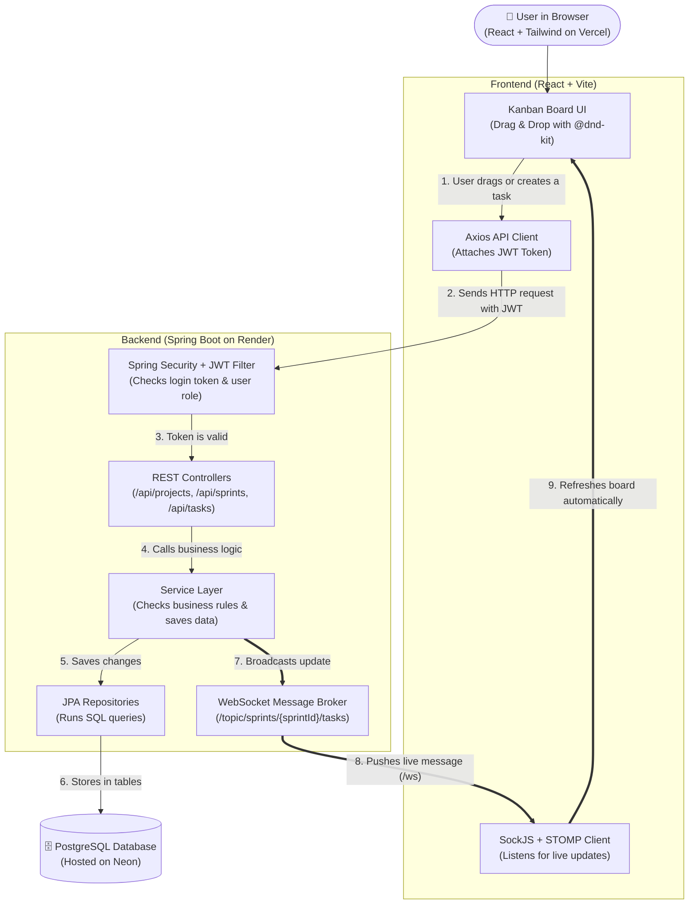
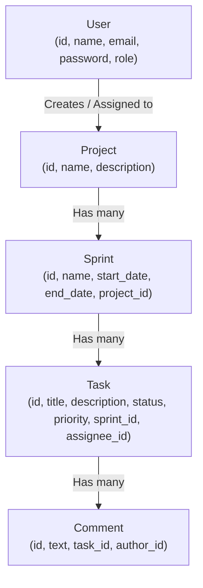

# Team Task & Sprint Tracker

A full-stack project and task tracker I built to learn how **Spring Boot**, **React**, **PostgreSQL**, and **real-time WebSockets** work together in a real web application.

🔗 **Live Demo:** [https://task-sprint-tracker.vercel.app](https://task-sprint-tracker.vercel.app)

---

## Why I Built This Project

When I started learning backend and frontend development, most beginner projects I saw were simple single-table To-Do lists where you had to refresh the page every time something changed.

I wanted to challenge myself as a student to build something closer to what real teams use every day (like a simplified Jira or Trello):
- Teams can organize their work step by step: **Projects → Sprints → Tasks → Comments**.
- Users can drag and drop tasks across **TODO**, **IN PROGRESS**, and **DONE** columns on a Kanban board.
- When one teammate moves or creates a task, **everyone else looking at that board sees it update live without refreshing the page**.

---

## Tech Stack (Kept Simple & Practical)

| Part of the App | What I Used | Why I Used It |
| :--- | :--- | :--- |
| **Backend** | Java 21, Spring Boot 3, Spring Security, Spring Data JPA | To build REST APIs, talk to the database, and handle security |
| **Real-Time Updates** | Spring WebSocket (STOMP + SockJS) | To push live board changes to connected browsers instantly |
| **Database** | PostgreSQL (Hosted on Neon) + H2 (for tests) | Cloud Postgres so I didn't overload my 8GB RAM laptop locally |
| **Authentication** | JWT (JSON Web Tokens) + BCrypt | To hash passwords safely and keep users logged in across requests |
| **Frontend** | React (Vite), Tailwind CSS, React Query, Axios, `@dnd-kit` | Fast UI with drag-and-drop cards and automatic data fetching |
| **Testing & CI** | JUnit 5 + Mockito, GitHub Actions | To test my service logic automatically whenever I push code |
| **Deployment** | Render (Backend Docker) · Vercel (Frontend) · Neon (DB) | Free cloud hosting so anyone can try the app live |

---

## System Architecture (Vertical Flow)

Here is how a user action flows from the browser all the way to the database and back to everyone on the board:



---

## Database Relationships

Instead of putting everything in one table, I connected 5 tables so the data stays organized:



---

## Core Features & Rules Implemented

### 1. Login, Registration & Roles
- Passwords are encrypted using **BCrypt** (plain-text passwords are never stored).
- Logging in returns a **JWT token** that the frontend saves and sends in the `Authorization: Bearer <token>` header.
- Three roles are supported:
  - **ADMIN:** Full access to everything.
  - **MANAGER:** Can create and delete Projects and Sprints, and manage all tasks.
  - **MEMBER:** Can view boards, create tasks, claim unassigned tasks, and move their own assigned tasks.

### 2. Practical Business Rules
- **No "DONE" Without an Assignee:** A task cannot be moved to the `DONE` column unless someone is assigned to it (`Cannot move task to DONE without an assignee`).
- **Logical Sprint Dates:** A sprint's end date cannot be earlier than its start date.
- **Clean Error Messages:** A `GlobalExceptionHandler` catches validation and business-rule errors and sends clear messages back to the React UI instead of crashing.

---

## Main API Endpoints

| Method | Endpoint | What It Does |
| :--- | :--- | :--- |
| `GET` | `/api/health` | Public health check used by Render (`{"status": "UP"}`) |
| `POST` | `/api/auth/register` | Register a new user account |
| `POST` | `/api/auth/login` | Log in and receive a JWT token |
| `GET / POST` | `/api/projects` | View all projects or create a new project |
| `DELETE` | `/api/projects/{id}` | Delete a project and all its sprints, tasks, and comments |
| `GET` | `/api/sprints/project/{projectId}` | Get all sprints inside a project |
| `POST / DELETE` | `/api/sprints` | Create or delete a sprint (Managers & Admins) |
| `GET` | `/api/tasks/sprint/{sprintId}` | Get all tasks for a sprint's Kanban board |
| `POST / PUT / DELETE` | `/api/tasks` | Create, move/update, or delete a task (triggers WebSocket update) |
| `GET / POST` | `/api/comments` | View or add comments on a task |

---

## Challenges I Faced & What I Learned (My Honest Journey)

Building this project was a huge learning curve for me. Coming in as a beginner to Spring Boot and full-stack deployment, there were moments where I felt overwhelmed by all the annotations, security filters, and deployment errors—and I had to debug them step by step:

1. **"It worked on my Windows laptop, why did it fail on Linux/Render?"**
   - Locally on Windows, my code compiled fine even though my file was named `JWTService.java` while the class inside was `public class JwtService` (and my Docker file was named `DockerFile`). When I pushed to GitHub Actions and Render (which run on Linux), the build failed immediately because Linux is strictly case-sensitive. Fixing that taught me how important file naming and CI pipelines are in real teams.

2. **Debugging the Cloud Database Connection (JDBC URL Format)**
   - My first Render deployment built the Docker image successfully but crashed on startup with `Unable to determine Dialect without JDBC metadata`. I learned that Java's JDBC driver cannot read `username:password@host` inside the URL the way Node.js or Python does—it needs a clean `jdbc:postgresql://host/dbname` URL with the username and password passed as separate environment variables.

3. **Connecting Vercel to Render (Proxies & CORS)**
   - During local development, Vite's proxy forwarded `/api` and `/ws` to `localhost:8080`, so everything worked without CORS issues. Once deployed to Vercel and Render on two different domains, I had to configure `VITE_API_URL` on the frontend and enable CORS in both `SecurityConfig` and `WebSocketConfig` on the backend.

4. **Getting Comfortable with Spring Boot Annotations**
   - At first, seeing `@RestController`, `@Service`, `@PreAuthorize`, and `@RestControllerAdvice` felt like magic. Breaking the backend into simple layers—**Controllers** (receive the request), **Services** (check plain Java `if` rules), **Repositories** (talk to the database), and **GlobalExceptionHandler** (a global `try-catch`)—made everything click for me.

---

## What I Plan to Improve Next

This project is a strong working MVP, and I am continuing to learn and improve it:
- [ ] **Task Comments UI Modal:** The backend CRUD APIs for comments (`/api/comments`) are already built and tested; next, I want to add a slide-over panel on each task card so teammates can chat inside a task on the frontend.
- [ ] **Deeper JPA Entity Relationships:** Upgrade `assigneeId` and `authorId` from simple ID numbers to full `@ManyToOne` `User` relationships so task cards display the assignee's full name and avatar directly.
- [ ] **Team Member Invite & Filter Bar:** Allow filtering the Kanban board by priority (`HIGH`, `MEDIUM`, `LOW`) or by assigned teammate.

---

## How to Run Locally

### 1. Backend (`Spring Boot`)
Create `Backend/src/main/resources/application-local.properties` with your PostgreSQL details:
```properties
spring.datasource.url=jdbc:postgresql://<your-neon-host>/neondb?sslmode=require
spring.datasource.username=<your-db-username>
spring.datasource.password=<your-db-password>
app.jwt.secret=your-local-secret-key-at-least-32-characters-long
app.jwt.expiration=86400000
```
Run the backend (or run the automated tests):
```bash
cd Backend
./mvnw clean test
./mvnw spring-boot:run
```

### 2. Frontend (`React + Vite`)
```bash
cd Frontend
npm install
npm run dev
```
Open `http://localhost:5173`.

---

## DevSecOps Pipeline Overview

**In simple terms:** changes submitted in a pull request to `main` or pushed directly to `main` are checked automatically. GitHub Actions builds and tests the backend, then runs code and image security checks. Only a successful push to `main` can publish the already-scanned Docker image to JFrog. Kubernetes manifests are provided for a later/manual deployment; the current pipeline does **not** run `kubectl` automatically.

**Quick vocabulary:** CI/CD is the automation that builds and checks software when code changes. A security scan is an automatic search for known risky code or packages. An image registry is a storage place for finished Docker images—similar to a package shelf that Kubernetes can download from.

### Full pipeline flow

The security checks run side-by-side after the build. Pull requests targeting `main` get checks but do not publish an image. For a forked pull request, GitHub skips CodeQL upload because the fork receives a read-only token; the build and Trivy checks still run.

```text
Developer opens a pull request to main or pushes a commit to main
                         |
                         v
              GitHub Actions starts
                         |
                         v
       +------------------------------------+
       | Stage 1: Build and test (Maven)    |
       | Compile, run JUnit/Mockito tests,  |
       | and create the backend package    |
       +------------------+-----------------+
                          |
              +-----------+-----------+
              |                       |
              v                       v
+---------------------------+  +---------------------------+
| Stage 2: CodeQL           |  | Stage 3: Trivy            |
| Check Java code for       |  | Scan files/dependencies   |
| common security mistakes  |  | Build and scan Docker     |
|                           |  | image; save scanned image |
+-------------+-------------+  +-------------+-------------+
              |                              |
              +--------------+---------------+
                             |
                             v
         Did both security jobs complete successfully?
                             |
                   +---------+---------+
                   |                   |
                Pull request       Push to main
                   |                   |
          Show checks; do not            v
          publish an image      +--------------------------+
                                | Stage 4: Push to JFrog   |
                                | Tag with commit SHA and  |
                                | latest; push scanned     |
                                | image to Artifactory     |
                                +------------+-------------+
                                             |
                                             v
                             Kubernetes can pull the image
                             after cluster secrets are set
                                             |
                                             v
                             Backend runs as two pods in
                             the Kubernetes deployment
```

A **container image** is the packaged backend that Docker and Kubernetes can run. A **commit SHA** is a unique code-change ID, so the image can be traced to the source version that produced it.

Before the JFrog push job can log in, GitHub must have the `JFROG_URL` and `JFROG_TOKEN` repository secrets plus a `JFROG_USERNAME` Actions variable. The URL is the registry hostname only (no `https://` or trailing slash). Keep these values in GitHub settings, not in this README or the workflow file.

### DevSecOps tools in this repository

| Tool | Category | What it does | Where the file is |
| :--- | :--- | :--- | :--- |
| Docker / Buildx | Container packaging | Packages the backend and its Java runtime into an image; Buildx builds the image that Trivy scans in GitHub Actions | `Backend/Dockerfile`, `Backend/.dockerignore`, `.github/workflows/ci.yml` |
| Apache Maven | Build automation | Downloads Java dependencies, compiles/tests the backend, and creates its JAR package | `Backend/pom.xml` and the three pipeline files |
| JUnit / Mockito | Automated testing | JUnit runs backend tests; Mockito creates test doubles used by service tests | `Backend/pom.xml`, `Backend/src/test/` |
| GitHub Actions | CI/CD automation | Builds/tests changes, runs scans, and publishes the scanned image on `main` | `.github/workflows/ci.yml` |
| CodeQL | Source-code security scan | Looks for common security weaknesses in Java code | `.github/workflows/ci.yml` |
| Trivy | Dependency and image security scan | Scans repository files and Docker images for known issues | `.github/workflows/ci.yml`, `Jenkinsfile`, `azure-pipelines.yml` |
| Dependabot | Dependency update automation | Checks weekly for updates to Maven packages, Actions, and Docker base images | `.github/dependabot.yml` |
| Jenkins | CI/CD automation | Demonstrates a declarative build, test, package, Docker build, and image-scan pipeline | `Jenkinsfile` |
| Azure Pipelines | CI/CD automation | Demonstrates an Azure build/test stage and a Docker/Trivy security stage | `azure-pipelines.yml` |
| `kubectl` | Kubernetes command-line tool | Applies the Kubernetes manifests manually; it is not called by the current CI/CD pipeline | Example commands below; manifests in `k8s/` |
| Kubernetes | Container orchestration | Describes how to run, route, secure, and monitor the backend pods | `k8s/deployment.yml`, `k8s/service.yml`, `k8s/secret.yml`, `k8s/serviceaccount.yml`, `k8s/role.yml`, `k8s/rolebinding.yml`, `k8s/networkpolicy.yml` |
| JFrog Artifactory | Container image registry | Stores versioned Docker images so Kubernetes or another environment can pull them | JFrog push job in `.github/workflows/ci.yml`; image path in `k8s/deployment.yml` |

**Important:** Dependabot is a scheduled update bot, not a stage that runs inside each build. CodeQL currently runs in GitHub Actions. Jenkins and Azure Pipelines have Trivy image scans; the GitHub workflow also has CodeQL and a Trivy filesystem scan.

### Three CI/CD platforms

All three definitions demonstrate the same basic ideas—build, test, package, and scan—but their exact steps are not identical. CI/CD means the computer repeats these checks automatically instead of relying on someone to remember them.

| Stage | GitHub Actions | Jenkins | Azure Pipelines |
| :--- | :--- | :--- | :--- |
| Build | `mvn clean verify` builds from `Backend/` | `mvn clean compile` from `Backend/` | `mvn clean package -DskipTests` from `Backend/` |
| Test | Tests run as part of Maven `verify` | Separate `mvn test`; JUnit results are published | Separate `mvn test`; JUnit results are published |
| Package | Maven `verify` creates the backend package; the Trivy job builds the Docker image | Separate Maven package stage, then Docker image build | Maven package step, then Docker image build |
| Scan | CodeQL plus Trivy filesystem and image scans | Trivy image scan | Trivy image scan |
| Publish | Pushes the scanned image to JFrog on pushes to `main` only | No registry push in this example | No registry push in this example |
| File and language | `.github/workflows/ci.yml` — YAML | `Jenkinsfile` — Declarative Pipeline (Groovy-based syntax) | `azure-pipelines.yml` — YAML |

### Security decisions

- **Multi-stage Docker build:** Maven and the full JDK are used to build the JAR, but only the JRE and JAR go into the runtime image.
- **Non-root container user:** The application runs as `appuser`, limiting the damage a compromised process could do.
- **Trivy `exit-code: 0`:** Findings are reported but do not currently fail the pipeline. This is a learning/baseline setting, not a strict security gate; a production policy should fail on agreed severity levels after findings are triaged.
- **Infrastructure as Code:** Pipeline and Kubernetes definitions are reviewable, version-controlled files. Real secrets must stay outside Git.
- **Least-privilege RBAC:** The Role only grants `get` and `list` for ConfigMaps in `default`. The pod also disables its service-account token, so the application cannot use Kubernetes API permissions unless that is deliberately changed later.
- **NetworkPolicy:** Backend ingress is limited to frontend-labelled pods on port 8080. Egress is limited to TCP port 5432 and DNS over UDP port 53. Standard Kubernetes NetworkPolicy cannot filter by a database hostname, so the current TCP/5432 rule allows that port to any IP; use Neon IP ranges or an FQDN-aware CNI policy for a tighter production rule.
- **Kubernetes Secrets:** The application reads database/JWT values from a Secret instead of source-code literals. The committed `k8s/secret.yml` contains placeholders only. Base64 is encoding, not encryption.
- **Publish only from `main`:** JFrog credentials are used only by the gated push job after the CodeQL and Trivy jobs complete successfully. Pull requests cannot publish to the shared registry through this workflow.

---

## Kubernetes Architecture

**In simple terms:** the Service gives the backend a stable in-cluster address. It sends requests to either of the two backend pods. The frontend is shown below to explain the intended connection; this repository does not include a frontend Kubernetes Deployment manifest.

```text
      JFrog Artifactory (stores the Docker image)
                         |
              Kubernetes pulls the image
                         v
+----------------------------------------------------------------+
| Kubernetes cluster — default namespace                        |
|                                                                |
|  React frontend pods (deployed separately)                    |
|          |                                                     |
|          | HTTP/WebSocket; NetworkPolicy allows port 8080       |
|          v                                                     |
|  +---------------------------+                                 |
|  | ClusterIP Service         |  Stable in-cluster address      |
|  | port 80 -> target 8080     |                                 |
|  +-------------+-------------+                                 |
|                |                                               |
|       +--------+--------+                                      |
|       v                 v                                      |
|  +-------------+   +-------------+                              |
|  | Backend pod |   | Backend pod |  Deployment replicas: 2      |
|  | Spring Boot |   | Spring Boot |  container port: 8080       |
|  +------+------+   +------+------+                              |
|         |                 |                                     |
|         +--------+--------+                                     |
|                  |                                              |
|     Secret supplies database/JWT environment values             |
|     ServiceAccount token is not mounted                         |
+------------------+---------------------------------------------+
                   | TCP 5432 (NetworkPolicy egress)
                   v
          +-------------------------+
          | Neon PostgreSQL         |
          | External to the cluster |
          +-------------------------+
```

### Kubernetes manifest files

| File | Resource | Purpose |
| :--- | :--- | :--- |
| `k8s/deployment.yml` | Deployment and pods | Runs two backend replicas, loads configuration, sets resource limits, and checks health/readiness. |
| `k8s/service.yml` | ClusterIP Service | Gives other pods a stable port-80 address that forwards to backend port 8080. |
| `k8s/secret.yml` | Opaque Secret | Shows the four required app-secret keys with placeholders only. Replace/create the real Secret outside Git. |
| `k8s/serviceaccount.yml` | ServiceAccount | Gives the workload a dedicated identity; automatic API-token mounting is disabled. |
| `k8s/role.yml` | Role | Grants only ConfigMap `get` and `list` in the `default` namespace. |
| `k8s/rolebinding.yml` | RoleBinding | Connects the narrow Role to `sprint-tracker-sa`. |
| `k8s/networkpolicy.yml` | NetworkPolicy | Restricts backend ingress and egress; see the TCP/5432 destination caveat above. |

### Example deployment commands

These commands are a reference, not a complete production secret-management setup. **Do not apply the committed placeholder values to a live cluster.** Create the real application Secret from a secure source (such as a secret manager or a protected environment file) and create the separate JFrog image-pull Secret before applying the Deployment. Keep both secrets outside Git. The deployment image contains `${JFROG_URL}` as a template; Kubernetes does not expand it automatically.

```bash
# The protected env file contains DATABASE_URL, DATABASE_USERNAME, DATABASE_PASSWORD,
# and JWT_SECRET. Keep it outside this repository and restrict access to it.
kubectl create secret generic sprint-tracker-secrets \
  --namespace=default \
  --from-env-file=/secure/path/sprint-tracker.env \
  --dry-run=client -o yaml | kubectl apply -f -

kubectl apply -f k8s/serviceaccount.yml
kubectl apply -f k8s/role.yml
kubectl apply -f k8s/rolebinding.yml
kubectl apply -f k8s/service.yml
kubectl apply -f k8s/networkpolicy.yml

# Example for Bash/WSL; envsubst is included with GNU gettext. Use the registry
# hostname only, with no https:// prefix or trailing slash.
export JFROG_URL=your-tenant.jfrog.io
envsubst '${JFROG_URL}' < k8s/deployment.yml | kubectl apply -f -
```

The Deployment references a separate image-pull Secret named `jfrog-registry-credentials`. The cluster needs that Secret to pull a private image from JFrog. Create it through a secrets manager or another credential-safe process; do not put its token in a committed file. Keep its credentials separate from the app’s `sprint-tracker-secrets` Secret.

---

## Docker Image Details

A **Docker image** is the packaged application. The Dockerfile uses two stages so build tools are not shipped with the running service.

```text
Stage 1: Build (maven:3.9-eclipse-temurin-21)
  |-- Copy pom.xml first and download dependencies
  |-- Copy src/ and package the Java application
  `-- Output: backend JAR in target/
                 |
                 | COPY --from=build copies the JAR only
                 v
Stage 2: Run (eclipse-temurin:21-jre-alpine)
  |-- Run as non-root user appuser
  |-- HEALTHCHECK requests /actuator/health every 30 seconds
  `-- ENTRYPOINT starts java -jar /app/app.jar
```

- **Why Alpine?** The Alpine JRE image is a small runtime base, which keeps the final image leaner than a full development image. A smaller image also contains fewer unnecessary tools.
- **Why non-root?** The service runs as `appuser`, not the powerful root account. This follows the principle of giving a process only the permissions it needs.
- **Why a health check?** It asks the application whether it is responding. Docker can mark the container healthy or unhealthy; Kubernetes has its own liveness and readiness probes for restart and traffic decisions.
- **Why two stages?** Maven and the compiler are needed only to build. The final stage contains the runnable JAR and JRE, not the build toolchain or source tree.

---

## License
MIT License © 2026 Venkata Vikranth Jannatha
