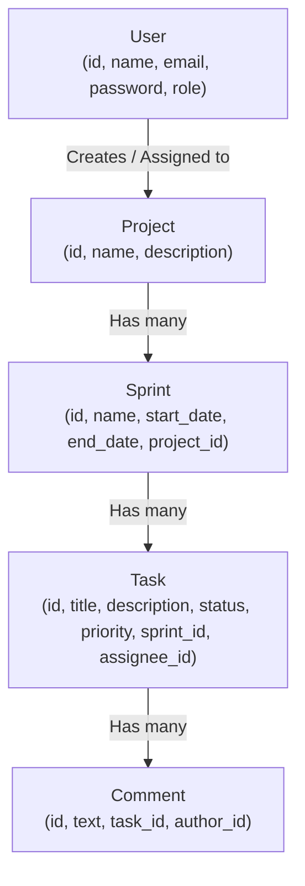

# Team Task & Sprint Tracker

A full-stack project and task tracker I built to learn how **Spring Boot**, **React**, **PostgreSQL**, and **real-time WebSockets** work together in a real web application.

🔗 **Live Demo:** [https://task-sprint-tracker.vercel.app](https://task-sprint-tracker.vercel.app)

---

## Why I Built This Project

When I started learning backend and frontend development, most beginner projects I saw were simple single-table To-Do lists where you had to refresh the page every time something changed.

I wanted to challenge myself as a student to build something closer to what real teams use every day (like a simplified Jira or Trello):
- Teams can organize their work step by step: **Projects → Sprints → Tasks → Comments**.
- Users can drag and drop tasks across **TODO**, **IN PROGRESS**, and **DONE** columns on a Kanban board.
- When one teammate moves or creates a task, **everyone else looking at that board sees it update live without refreshing the page**.

---

## Tech Stack (Kept Simple & Practical)

| Part of the App | What I Used | Why I Used It |
| :--- | :--- | :--- |
| **Backend** | Java 21, Spring Boot 3, Spring Security, Spring Data JPA | To build REST APIs, talk to the database, and handle security |
| **Real-Time Updates** | Spring WebSocket (STOMP + SockJS) | To push live board changes to connected browsers instantly |
| **Database** | PostgreSQL (Hosted on Neon) + H2 (for tests) | Cloud Postgres so I didn't overload my 8GB RAM laptop locally |
| **Authentication** | JWT (JSON Web Tokens) + BCrypt | To hash passwords safely and keep users logged in across requests |
| **Frontend** | React (Vite), Tailwind CSS, React Query, Axios, `@dnd-kit` | Fast UI with drag-and-drop cards and automatic data fetching |
| **Testing & CI** | JUnit 5 + Mockito, GitHub Actions | To test my service logic automatically whenever I push code |
| **Deployment** | Render (Backend Docker) · Vercel (Frontend) · Neon (DB) | Free cloud hosting so anyone can try the app live |

---

## System Architecture (Vertical Flow)

Here is how a user action flows from the browser all the way to the database and back to everyone on the board:


---

## Database Relationships

Instead of putting everything in one table, I connected 5 tables so the data stays organized:



---

## Core Features & Rules Implemented

### 1. Login, Registration & Roles
- Passwords are encrypted using **BCrypt** (plain-text passwords are never stored).
- Logging in returns a **JWT token** that the frontend saves and sends in the `Authorization: Bearer <token>` header.
- Three roles are supported:
  - **ADMIN:** Full access to everything.
  - **MANAGER:** Can create and delete Projects and Sprints, and manage all tasks.
  - **MEMBER:** Can view boards, create tasks, claim unassigned tasks, and move their own assigned tasks.

### 2. Practical Business Rules
- **No "DONE" Without an Assignee:** A task cannot be moved to the `DONE` column unless someone is assigned to it (`Cannot move task to DONE without an assignee`).
- **Logical Sprint Dates:** A sprint's end date cannot be earlier than its start date.
- **Clean Error Messages:** A `GlobalExceptionHandler` catches validation and business-rule errors and sends clear messages back to the React UI instead of crashing.

---

## Main API Endpoints

| Method | Endpoint | What It Does |
| :--- | :--- | :--- |
| `GET` | `/api/health` | Public health check used by Render (`{"status": "UP"}`) |
| `POST` | `/api/auth/register` | Register a new user account |
| `POST` | `/api/auth/login` | Log in and receive a JWT token |
| `GET / POST` | `/api/projects` | View all projects or create a new project |
| `DELETE` | `/api/projects/{id}` | Delete a project and all its sprints, tasks, and comments |
| `GET` | `/api/sprints/project/{projectId}` | Get all sprints inside a project |
| `POST / DELETE` | `/api/sprints` | Create or delete a sprint (Managers & Admins) |
| `GET` | `/api/tasks/sprint/{sprintId}` | Get all tasks for a sprint's Kanban board |
| `POST / PUT / DELETE` | `/api/tasks` | Create, move/update, or delete a task (triggers WebSocket update) |
| `GET / POST` | `/api/comments` | View or add comments on a task |

---

## Challenges I Faced & What I Learned (My Honest Journey)

Building this project was a huge learning curve for me. Coming in as a beginner to Spring Boot and full-stack deployment, there were moments where I felt overwhelmed by all the annotations, security filters, and deployment errors—and I had to debug them step by step:

1. **"It worked on my Windows laptop, why did it fail on Linux/Render?"**
   - Locally on Windows, my code compiled fine even though my file was named `JWTService.java` while the class inside was `public class JwtService` (and my Docker file was named `DockerFile`). When I pushed to GitHub Actions and Render (which run on Linux), the build failed immediately because Linux is strictly case-sensitive. Fixing that taught me how important file naming and CI pipelines are in real teams.

2. **Debugging the Cloud Database Connection (JDBC URL Format)**
   - My first Render deployment built the Docker image successfully but crashed on startup with `Unable to determine Dialect without JDBC metadata`. I learned that Java's JDBC driver cannot read `username:password@host` inside the URL the way Node.js or Python does—it needs a clean `jdbc:postgresql://host/dbname` URL with the username and password passed as separate environment variables.

3. **Connecting Vercel to Render (Proxies & CORS)**
   - During local development, Vite's proxy forwarded `/api` and `/ws` to `localhost:8080`, so everything worked without CORS issues. Once deployed to Vercel and Render on two different domains, I had to configure `VITE_API_URL` on the frontend and enable CORS in both `SecurityConfig` and `WebSocketConfig` on the backend.

4. **Getting Comfortable with Spring Boot Annotations**
   - At first, seeing `@RestController`, `@Service`, `@PreAuthorize`, and `@RestControllerAdvice` felt like magic. Breaking the backend into simple layers—**Controllers** (receive the request), **Services** (check plain Java `if` rules), **Repositories** (talk to the database), and **GlobalExceptionHandler** (a global `try-catch`)—made everything click for me.

---

## What I Plan to Improve Next

This project is a strong working MVP, and I am continuing to learn and improve it:
- [ ] **Task Comments UI Modal:** The backend CRUD APIs for comments (`/api/comments`) are already built and tested; next, I want to add a slide-over panel on each task card so teammates can chat inside a task on the frontend.
- [ ] **Deeper JPA Entity Relationships:** Upgrade `assigneeId` and `authorId` from simple ID numbers to full `@ManyToOne` `User` relationships so task cards display the assignee's full name and avatar directly.
- [ ] **Team Member Invite & Filter Bar:** Allow filtering the Kanban board by priority (`HIGH`, `MEDIUM`, `LOW`) or by assigned teammate.

---

## How to Run Locally

### 1. Backend (`Spring Boot`)
Create `Backend/src/main/resources/application-local.properties` with your PostgreSQL details:
```properties
spring.datasource.url=jdbc:postgresql://<your-neon-host>/neondb?sslmode=require
spring.datasource.username=<your-db-username>
spring.datasource.password=<your-db-password>
app.jwt.secret=your-local-secret-key-at-least-32-characters-long
app.jwt.expiration=86400000
```
Run the backend (or run the automated tests):
```bash
cd Backend
./mvnw clean test
./mvnw spring-boot:run
```

### 2. Frontend (`React + Vite`)
```bash
cd Frontend
npm install
npm run dev
```
Open `http://localhost:5173`.

---

## License
MIT License © 2026 Venkata Vikranth Jannatha
