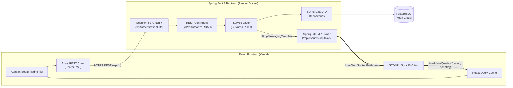

# Team Task & Sprint Tracker

A real-time, full-stack Agile Sprint & Kanban Task Management platform built with **Java 21**, **Spring Boot 3**, **React (Vite)**, **PostgreSQL (Neon)**, **JWT Security**, and **STOMP/SockJS WebSockets**.

🔗 **Live Demo (Frontend on Vercel):** [https://task-sprint-tracker.vercel.app](https://task-sprint-tracker.vercel.app)

---

## 1. Problem Statement & Overview

Most starter task trackers only perform basic CRUD operations and require every team member to manually refresh their browser to see board changes.

**Team Task & Sprint Tracker** solves this by combining:
1. **Hierarchical Agile Organization:** Teams structure work across `Projects → Sprints → Tasks → Comments`.
2. **Real-Time Multi-User Sync (WebSockets):** Moving a task across `TODO`, `IN_PROGRESS`, and `DONE` columns (or creating/deleting a task) broadcasts live updates over **STOMP/SockJS WebSockets** (`/topic/sprints/{sprintId}/tasks`), updating every connected teammate's Kanban board immediately without a page reload.
3. **Stateless JWT & Role-Based Access Control (RBAC):** Fine-grained permissions for `ADMIN`, `MANAGER`, and `MEMBER` roles.
4. **Domain Business Rules:** Enforces real Agile rules on the backend (e.g., tasks cannot move to `DONE` without an assignee; sprint end dates cannot precede start dates).

---

## 2. Tech Stack

| Layer | Technologies Used |
| :--- | :--- |
| **Backend** | Java 21, Spring Boot 3.4.5, Spring Security 6, Spring Data JPA (Hibernate), Spring WebSocket (STOMP + SockJS), Jakarta Bean Validation |
| **Authentication** | Stateless JWT (`io.jsonwebtoken / jjwt 0.12.6`, HMAC-SHA256) + BCrypt Password Hashing |
| **Database** | PostgreSQL (Production on **Neon**) · H2 In-Memory Database (Automated Test Suite) |
| **Frontend** | React 19 (Vite), Tailwind CSS, TanStack React Query, Axios, `@dnd-kit` (Drag-and-Drop Kanban), `@stomp/stompjs` + `sockjs-client` |
| **Testing & CI/CD** | JUnit 5, Mockito, Spring `MockMvc` (**35 automated unit & integration tests**), GitHub Actions, CircleCI |
| **Cloud Hosting** | Backend: **Render** (Docker container) · Frontend: **Vercel** · Database: **Neon Serverless PostgreSQL** |

---

## 3. System Architecture



---

## 4. Entity Relationship Diagram (Data Model)

```text
User (id, name, email, password, role: ADMIN | MANAGER | MEMBER)
 │
 │ (1:N logical ownership / assignment)
 ▼
Project (id, name, description, created_at, updated_at)
 │
 │ 1 ─── N (Cascade delete via ProjectService)
 ▼
Sprint (id, name, project_id [FK], start_date, end_date, created_at, updated_at)
 │
 │ 1 ─── N (Cascade delete via SprintService)
 ▼
Task (id, title, description, status: TODO | IN_PROGRESS | DONE,
      priority: LOW | MEDIUM | HIGH, sprint_id [FK], assignee_id, created_at, updated_at)
 │
 │ 1 ─── N (Cascade delete via TaskService)
 ▼
Comment (id, text, task_id [FK], author_id, created_at, updated_at)
```

---

## 5. Business Rules & Role-Based Permissions (RBAC)

### Enforced Domain Business Rules
1. **Assignee Required Before `DONE`:** A task cannot be created with or moved to `DONE` if `assigneeId` is `null` (`400 Bad Request`: `"Cannot move task to DONE without an assignee"`).
2. **Logical Sprint Dates:** A sprint's `endDate` cannot be earlier than its `startDate` (`400 Bad Request`: `"Sprint end date cannot be earlier than start date"`).
3. **Strict Priority Validation:** Task priority must be `LOW`, `MEDIUM`, or `HIGH` (defaults to `MEDIUM`).
4. **Transactional Cascading Deletes:** Deleting a Project cleanly removes its Sprints, Tasks, and Comments inside a `@Transactional` boundary.

### Role Permissions Matrix

| Role | Capabilities |
| :--- | :--- |
| **`ADMIN`** | Full access across all projects, sprints, tasks, and comments. |
| **`MANAGER`** | Can create, update, and delete **Projects** and **Sprints** (`@PreAuthorize("hasAnyRole('ADMIN', 'MANAGER')")`), and manage any task. |
| **`MEMBER`** | Can view projects/sprints, create tasks/comments, claim unassigned tasks, and move/modify **only their own assigned tasks** (`403 Forbidden` if modifying another teammate's task). |

---

## 6. REST API & WebSocket Endpoints

| Method | Endpoint | Access | Description |
| :--- | :--- | :--- | :--- |
| `GET` | `/api/health` | Public | Health check endpoint (`{"status": "UP"}`) for Render monitoring |
| `POST` | `/api/auth/register` | Public | Register a user (`name`, `email`, `password`, `role`) |
| `POST` | `/api/auth/login` | Public | Authenticate user and receive JWT `token` + `user` info |
| `GET` | `/api/projects` | Authenticated | List all projects |
| `POST` | `/api/projects` | Authenticated | Create a new project |
| `GET` | `/api/projects/{id}` | Authenticated | Get single project details |
| `PUT` | `/api/projects/{id}` | `ADMIN`, `MANAGER` | Update project name/description |
| `DELETE` | `/api/projects/{id}` | `ADMIN`, `MANAGER` | Delete project and cascade sprints/tasks/comments |
| `GET` | `/api/sprints/project/{projectId}` | Authenticated | List sprints for a project |
| `POST` | `/api/sprints` | `ADMIN`, `MANAGER` | Create a sprint (validates `endDate >= startDate`) |
| `PUT` | `/api/sprints/{id}` | `ADMIN`, `MANAGER` | Update a sprint |
| `DELETE` | `/api/sprints/{id}` | `ADMIN`, `MANAGER` | Delete a sprint and cascade its tasks/comments |
| `GET` | `/api/tasks/sprint/{sprintId}` | Authenticated | List tasks for a sprint board |
| `POST` | `/api/tasks` | Authenticated | Create task & broadcast to `/topic/sprints/{sprintId}/tasks` |
| `PUT` | `/api/tasks/{id}` | Authenticated* | Update/move task (checks `DONE` assignee & `MEMBER` ownership) & broadcast |
| `DELETE` | `/api/tasks/{id}` | Authenticated* | Delete task & broadcast `{ "deletedId": id }` |
| `GET` | `/api/comments/task/{taskId}` | Authenticated | List comments on a task |
| `POST` | `/api/comments` | Authenticated | Add a comment to a task |
| `WS` | `/ws` | Public handshake | SockJS/STOMP endpoint; subscribe to `/topic/sprints/{sprintId}/tasks` |

---

## 7. How JWT & Real-Time WebSockets Work (Interview Reference)

### Stateless JWT Flow
1. **Registration:** `AuthService` hashes the user's password with `BCryptPasswordEncoder` before saving to PostgreSQL.
2. **Login:** `AuthenticationManager` verifies credentials; `JwtService` signs a token with `HMAC-SHA256` containing the user's email and expiration timestamp.
3. **Request Filtering:** The React Axios interceptor attaches `Authorization: Bearer <token>` to every API call. On the backend, `JwtAuthenticationFilter` (`OncePerRequestFilter`) validates the signature, loads the user's role (`ROLE_ADMIN`, `ROLE_MANAGER`, `ROLE_MEMBER`), and populates `SecurityContextHolder`.

### Real-Time WebSockets (STOMP over SockJS) vs. Polling
- **Why WebSockets instead of HTTP Polling?** Polling forces every browser tab to send repeated HTTP requests every few seconds even when nothing changed, wasting server CPU and database connections. With WebSockets, the client opens a single persistent connection at `/ws` and subscribes to `/topic/sprints/{sprintId}/tasks`.
- **How Live Sync Works:** When `TaskService.createTask`, `updateTask`, or `deleteTask` saves a change to PostgreSQL, it calls `SimpMessagingTemplate.convertAndSend("/topic/sprints/" + sprintId + "/tasks", payload)`. The frontend `useWebSocket(sprintId)` hook receives the event and calls `queryClient.invalidateQueries({ queryKey: ['tasks', String(sprintId)] })`, seamlessly refreshing the Kanban columns for every connected user.

### Quick Spring Boot Annotations Cheat Sheet
- `@RestController` + `@RequestMapping`: Marks a class as an HTTP JSON API controller.
- `@Service`: Holds business rules (like checking task assignees and sprint dates).
- `@Transactional`: Ensures multi-step database operations (like cascading deletes) succeed together or roll back completely.
- `@PreAuthorize("hasAnyRole('ADMIN', 'MANAGER')")`: Checks the user's role before allowing a controller method to run.
- `@RestControllerAdvice` (`GlobalExceptionHandler`): Acts as a global `try-catch` across all controllers, turning Java exceptions into clean `400`, `401`, `403`, and `404` JSON responses.

---

## 8. Local Setup & Running Tests

### 1. Run Backend Tests (35 Unit & Integration Tests)
The test suite uses an in-memory H2 database (`Backend/src/test/resources/application.properties`), so no external database is required to run tests:
```bash
cd Backend
./mvnw clean test
```

### 2. Run Backend Locally
Create `Backend/src/main/resources/application-local.properties` (or pass environment variables):
```properties
spring.datasource.url=jdbc:postgresql://<your-neon-host>/neondb?sslmode=require
spring.datasource.username=<your-db-username>
spring.datasource.password=<your-db-password>
app.jwt.secret=your-local-secret-key-at-least-32-characters-long
app.jwt.expiration=86400000
```
Start the Spring Boot server:
```bash
cd Backend
./mvnw spring-boot:run
```

### 3. Run Frontend Locally
```bash
cd Frontend
npm install
npm run dev
```
Open `http://localhost:5173` (Vite automatically proxies `/api` and `/ws` to `http://localhost:8080`).

---

## License
MIT License © 2026 Venkata Vikranth Jannatha
